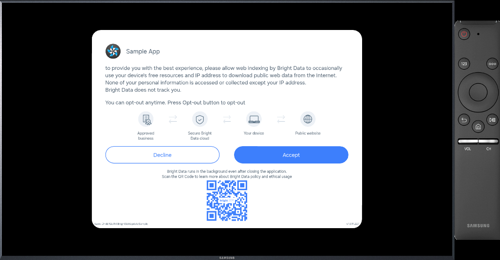
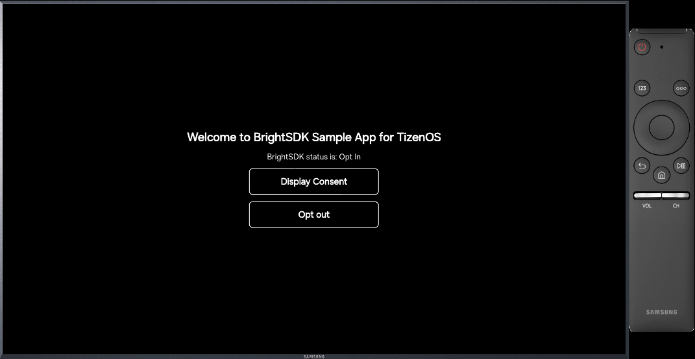

# BrightSDK — Tizen Integration Example

This folder demonstrates how to integrate BrightSDK into a Samsung Tizen TV app using the **bright-sdk-integration** CLI tool.

## Folder structure

```
tizen/
├── app/                        ← Tizen web app source
│   ├── config.xml              ← Tizen app manifest
│   ├── index.html              ← main HTML with BrightSDK init
│   ├── icon.png
│   ├── images/
│   └── js/
│       ├── main.js             ← Tizen app lifecycle (back key handler)
│       ├── brd_api.js          ← SDK core (created at runtime)
│       └── brd_api.helper.js   ← SDK helper wrapper
├── brd_sdk.config.json         ← SDK config (workdir, version, CDN URL)
├── package.json                ← npm scripts for update/reset
├── assets/                     ← screenshots
└── README.md                   ← this file
```

## Prerequisites

- **Node.js ≥ 18** — to run the integration tool
- **Tizen Studio** — to package, sign, and deploy to a TV or emulator
- A **BrightSDK API key** exported as `SDK_API_KEY` — see [obtain-api-key.md](https://brightsdk.github.io/bright-sdk-downloader-rs/obtain-api-key.html)
- An internet connection — the SDK zip is downloaded from the CDN on first run

## Quick start

### 1. Install SDK files

```sh
export SDK_API_KEY=<your-api-key>
cd tizen
npm run update
```

Or interactively (prompts for missing values):

```sh
export SDK_API_KEY=<your-api-key>
npm run update:interactive
```

The tool will:

1. Download the latest BrightSDK zip from `cdn.bright-sdk.com/static/`
2. Extract `brd_api.js` and `brd_api.helper.js` into `app/js/`
3. Extract the `service/` directory for the background service
4. Inject SDK script tags into `app/index.html`
5. Save `brd_sdk.config.json` for future runs

### 2. Build and run

Open the project in Tizen Studio, or use the CLI:

```sh
cd app
tizen build-web
tizen package -t wgt -s <your-certificate-profile>
tizen install -n BrightSdkUpdateSample.wgt
tizen run -p <app-id>
```

### 3. What the app shows

- On first launch, the SDK consent dialog is displayed automatically
- A status label reflecting the current SDK consent state (N/A, Opt In, Opt Out)
- **Display Consent** — calls `BrightSDK.showConsent()`
- **Opt out / Opt in** — toggles between `BrightSDK.disable()` and `BrightSDK.enable(true)`

### Screenshots

|           Consent dialog           |         Main screen          |
| :--------------------------------: | :--------------------------: |
|  |  |

## Using the tool with your own project

Copy `brd_sdk.config.json` next to your own app directory, then edit it:

```json
{
    "workdir": ".",
    "app_dir": "app",
    "libs_dir": "app/js",
    "index": "app/index.html",
    "sdk_service_dir": "app/service",
    "sdk_ver": "latest",
    "use_helper": true,
    "sdk_url": "https://cdn.bright-sdk.com/static/brd_sdk_tizen-SDK_VER.zip"
}
```

| Key               | Description                                                         |
| ----------------- | ------------------------------------------------------------------- |
| `workdir`         | Working directory for the tool.                                     |
| `app_dir`         | Directory containing your web app files.                            |
| `libs_dir`        | Directory where `brd_api.js` will be placed.                        |
| `index`           | Path to `index.html` — SDK script tags are injected here.           |
| `sdk_service_dir` | Directory for the background service.                               |
| `sdk_ver`         | `"latest"` or a specific version string.                            |
| `use_helper`      | Whether to include `brd_api.helper.js` (recommended).               |
| `sdk_url`         | CDN URL template — `SDK_VER` is replaced with the resolved version. |

Then run:

```sh
npm run update              # non-interactive
npm run update:interactive  # interactive (prompts for missing values)
npm run reset               # remove SDK files and restore clean state
```
